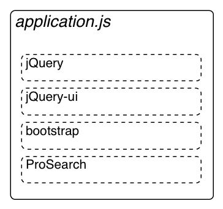

!SLIDE bullets

# Asset Pipeline

  * Powered by Sprockets
  * Similar to JAMMIT
  * Provide easy helper methods to link to assets
  * Keeps code structured
  
!SLIDE bullets

# Asset Pipeline - Structure

  
!SLIDE bullets

# Asset Pipeline - Combine

  * Manifest file defines files to include
  * Keeps code structured in development
  * Minimize HTTP requests in production
  
!SLIDE bullets

# Asset Pipeline - Combine

!SLIDE bullets

# Asset Pipeline - Preprocess

  * Allow preprocessing of CSS and JavaScript
  * Just add preprocessor extension to file name
  * Sass, CoffeScript, ERB, and more...
  * Ex: `sassy-pants.css.scss`
  

!SLIDE bullets

# Asset Pipeline - Minify

  * Strip whitespace
  * Rename JavaScript functions and variables
  * Reduce the number of characters to save data

!SLIDE bullets

# Asset Pipeline - Compress

  * tar and gzip the CSS and JS
  * Make the transfer time as small as possible

!SLIDE bullets

# Asset Pipeline - Cache

  * Append filenames with MD5 Hash of contents
  * Automatically figured out when using rails helpers
  * Super easy caching