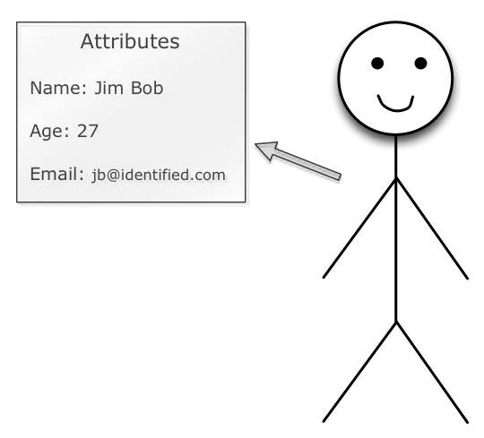
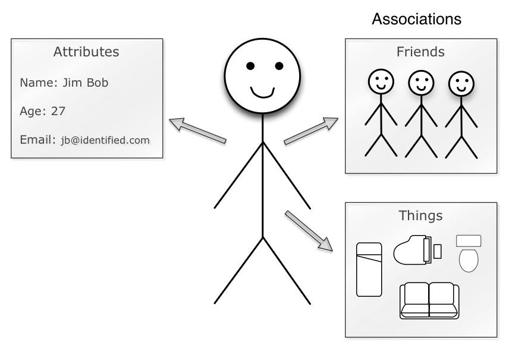
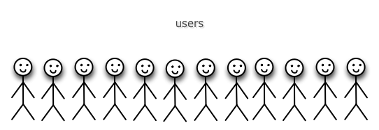

!SLIDE bullets
# Model

* Noun
* Person/Place/Thing

!SLIDE bullets
# Model Ex. - User

!SLIDE bullets
# Model Ex. - User

!SLIDE bullets
# Model Ex. - User

!SLIDE bullets
# Model Ex. - User

!SLIDE bullets
# Models in DB

